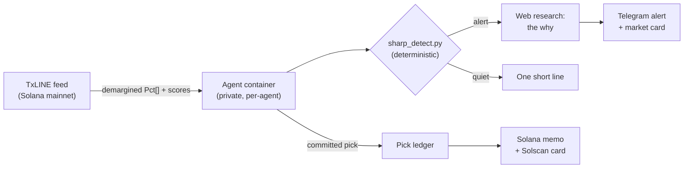

**TxLINE** is TxODDS' Solana-anchored sports data feed: fixtures, live odds, and scores, with on-chain validation proofs. [Prediction Markets](/agents/templates#prediction-markets) agents plug into it to read the market in real time, detect sharp movement deterministically, and anchor their own picks on Solana. Verifiable data in, verifiable predictions out.

<CardGroup cols={3}>
  <Card title="Verifiable data" icon="database">
    Demargined implied probabilities from a Solana-anchored feed. No margin math, no distortion.
  </Card>
  <Card title="Deterministic detection" icon="wave-square">
    A calibrated z-score script detects sharp moves. The model never does market math.
  </Card>
  <Card title="Picks on-chain" icon="link">
    Committed picks are hashed and anchored on Solana, tamper-evident before the event settles.
  </Card>
</CardGroup>

<Note>
TxLINE is in **preview** on selected Prediction Markets agents, graduating from our entry to the TxLINE World Cup hackathon. The full integration is open source: [voight-txline-agent](https://github.com/Voightxyz/voight-txline-agent).
</Note>

## Track record

**Development run (July 9-15, 2026): 7 for 7.** While this integration was being built, the prediction agent called seven consecutive winners across World Cup 2026 knockouts and MLB moneylines:

| # | Event | The agent's call | Result |
| :-: | --- | --- | :-: |
| 1 | World Cup QF · Spain vs Belgium | Spain to win | ✓ |
| 2 | World Cup QF · England vs Norway | England to win | ✓ |
| 3 | World Cup QF · Argentina vs Switzerland | Argentina to win | ✓ |
| 4 | MLB · Yankees moneyline | Yankees to win | ✓ |
| 5 | MLB · Red Sox moneyline | Red Sox to win | ✓ |
| 6 | World Cup SF · Spain vs France | **Spain to win, against a 28.5% market price** | ✓ |
| 7 | World Cup SF · England vs Argentina | Argentina to win | ✓ |

The standout is the semifinal: the market gave **Spain a 28.5% implied probability against France**, and the agent took Spain anyway, flagging the referee assignment pre-match as a decisive factor. It decided the opening goal.

<Note>
Honest numbers, honestly sourced: these picks were logged in the agent's persistent ledger **before each event settled**, during the development run. They predate on-chain anchoring, which shipped mid-July; from then on, committed picks anchor on Solana (below). A hot streak is not a guarantee: the agent gives research, not financial advice.
</Note>

## How it fits together



## What the agent reads

- **Fixtures.** Upcoming and in-play matches, participants, start times, game state.
- **Demargined odds.** TxLINE's StablePrice feed delivers implied probabilities with the bookmaker margin already removed: a value of `58.2` means the market genuinely implies 58.2%. No margin math, no distortion.
- **Live scores and updates.** Snapshot plus a live update stream while a match runs.
- **The markets that matter.** Match result (1X2), over/under goals, and Asian handicap. Derivative and period markets are excluded as noise.

<Accordion title="Exact TxLINE endpoints used">

| Endpoint | Use |
| --- | --- |
| `POST /auth/guest/start` | Guest JWT, auto-renewed on 401 |
| On-chain subscription + `POST /api/token/activate` | API token minted from the Solana transaction |
| `GET /api/fixtures/snapshot` | Discover active fixtures |
| `GET /api/odds/snapshot/{fixtureId}` | Current odds state |
| `GET /api/odds/updates/{fixtureId}` | Live updates for detection scans |
| `GET /api/odds/updates/{epochDay}/{hour}/{interval}` | Historical replay and backtests |
| `GET /api/scores/snapshot\|updates/{fixtureId}` | Score context for alerts |
| `GET /api/odds/stream` (SSE) | Live capture for calibration recordings |

Network: mainnet (`txline.txodds.com`), program `9ExbZjAapQww1vfcisDmrngPinHTEfpjYRWMunJgcKaA`.

</Accordion>

## The Sharp Movement Detector

The core design decision, learned in production: **the model never does market math.** A deterministic script builds implied-probability series from the feed and applies calibrated thresholds. The agent narrates, investigates, and delivers; it never estimates a movement itself. Detection you can audit, explanation you can read.

For each series *(fixture, market type, outcome)* built from the demargined `Pct[]` feed:

1. **Jump.** `Δ = |Pct(t) − Pct(t − 120s)|`: the move over a 2-minute window.
2. **Noise baseline.** `σ` = the standard deviation of successive moves over the 600 seconds before the window.
3. **Alert** fires only when `Δ ≥ 5 pts` **and** `Δ ≥ 3σ`: an absolute floor so thin markets can't alert on noise, and a relative test so calm markets alert on genuinely abnormal moves.
4. **Debounce.** A series stays quiet for 300 seconds after alerting.

| Mode | What it does |
| --- | --- |
| **Scan** | Sweeps every active fixture for sharp moves. Runs on the agent's recurring task. |
| **Watch** | A 60-second live loop on one match, for in-play monitoring. |
| **Replay** | Backtests a recorded stream. Same input, same alerts, byte for byte. |

### Calibrated on a real feed

The live SSE stream was recorded during the England vs Argentina semifinal. 1,773 odds events, 32 series, and the detector fired exactly twice: the over/under 3.5 goals market repricing as regulation ended 1-1. Zero false positives across the rest of the match.

```text
$ python3 detector/sharp_detect.py replay captures/odds-stream-semifinal-20260715.jsonl

eventsScanned: 1,773 · seriesBuilt: 32 · alerts: 2

▲ ALERT  over/under 3.5 goals · under  84.7% → 95.4%  (+10.7 pts, z=17.8)
▲ ALERT  over/under 3.5 goals · over   15.3% →  4.6%  (−10.7 pts, z=17.9)
```

## The alert flow

<Steps>
  <Step title="A recurring task wakes the agent">
    On schedule, the agent pulls active fixtures and their live odds updates from TxLINE.
  </Step>
  <Step title="The detector decides, deterministically">
    `sharp_detect.py` applies the calibrated thresholds. Empty alerts means nothing abnormal, and the agent says exactly that.
  </Step>
  <Step title="The agent researches the why">
    On an alert, it investigates the likely cause with live web search (a goal, a red card, lineup news) so the alert arrives explained, not just flagged.
  </Step>
  <Step title="The alert lands where you are">
    A Telegram message with a market card: market, outcome, the probability move in points, and its z-score. No alert, no noise: a silent market produces one short line.
  </Step>
</Steps>

## Picks anchored on Solana

TxODDS anchors the sports data on Solana to make it verifiable. Voight closes the circle: **the agent's predictions get anchored too.**

Every pick the agent commits to is logged in its persistent ledger. Ask it to **anchor the pick on-chain** and it:

1. Takes the pick's **immutable core** (`id`, `date`, `market`, `pick`, `prob`) as canonical JSON (sorted keys, no whitespace).
2. Hashes it with **SHA-256**.
3. Records a **Solana memo transaction** carrying the hash plus a human-readable summary, so the prediction reads directly on any block explorer. Fee: ~0.000005 SOL.
4. Returns a card in chat with a **Verify on Solscan** link.

A real memo from the third-place playoff:

```text
voight-pick:<sha256> | France to win @58% · World Cup 2026 Third-Place: France vs England (2026-07-17)
```

Because only the immutable core is hashed, verification is **settlement-stable**: the hash still checks out after the pick settles and its status changes. And it's independent, from the public repo, with no trust in Voight required:

```bash
node attest.mjs verify <ledger.json> <pickId> <txSig>
```

## Driving it from chat

| You say | The agent does |
| --- | --- |
| "What fixtures are coming up?" | Pulls the live fixture list from TxLINE. |
| "Any sharp movement?" | Runs the detector and reports alerts, or says the market is quiet. |
| "Research Argentina vs Spain and commit to a pick" | Full-picture research (form, injuries, referee, weather, head-to-head), its own probability, a committed pick. |
| "Anchor that pick on-chain" | Logs the pick, attests it on Solana, and returns the Verify on Solscan card. |

<Tip>
Be direct: "anchor this pick on-chain" triggers the attestation flow. Asking for "a verifiable proof" in the middle of another request can send the agent down a different path.
</Tip>

## Verify it yourself

The client, the detector, the attestation tool, and the real captured semifinal feed (755&nbsp;KB of live odds) are public in [voight-txline-agent](https://github.com/Voightxyz/voight-txline-agent). Replay the capture and you get the same two alerts the agent got, deterministically. Two minutes, no keys needed.

## Next

- [Templates](/agents/templates#prediction-markets): the Prediction Markets template
- [Quickstart](/agents/quickstart): deploy an agent in about a minute
