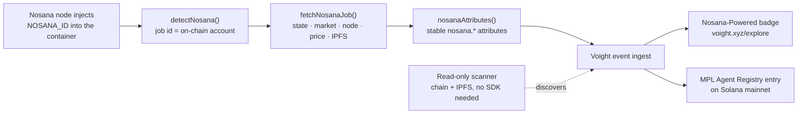

**[Nosana](https://nosana.com)** is a decentralized GPU network on Solana: every job that runs on it is a real on-chain account anyone can verify. Voight closes the loop for AI agents running there: the **[`@voightxyz/nosana`](https://www.npmjs.com/package/@voightxyz/nosana)** SDK detects the job from inside the container, correlates it with its on-chain account, and Voight's public explorer shows the agent as **Nosana-Powered**, with an entry in the MPL Agent Registry. Verifiable compute in, verifiable agents out.

<CardGroup cols={3}>
  <Card title="Auto-detection" icon="radar">
    One call reads the job id a Nosana node injects into every container. Zero dependencies.
  </Card>
  <Card title="On-chain correlation" icon="link">
    The job id IS a Solana account: state, GPU market, node, price, and timings, verifiable by anyone.
  </Card>
  <Card title="Nosana-Powered badge" icon="award">
    The agent's explorer profile carries the badge, linked to the job for independent verification.
  </Card>
</CardGroup>

<Note>
Looking to **run** an agent on a Nosana GPU rather than observe one? Voight Agents can be hosted on a dedicated Nosana GPU with a local model, in one click: see [GPU hosting](/agents/gpu-hosting). This page covers the other direction: observing agents that already run there.
</Note>

## How it fits together



Two ways in, same pipeline: agents that embed the SDK report themselves with live telemetry, and the read-only scanner discovers agents straight from public chain + IPFS data, no integration required.

## Quickstart

```bash
npm install @voightxyz/nosana
```

```ts
import { correlateNosana, nosanaAttributes } from '@voightxyz/nosana'

const nosana = await correlateNosana()
if (nosana) {
  const attrs = nosanaAttributes(nosana)
  // { 'nosana.job_id': '…', 'nosana.state': 'RUNNING', 'nosana.market': '…', … }
  // merge attrs into the metadata of any event you send to Voight
}
```

Send any event to Voight carrying those `nosana.*` attributes and the pipeline does the rest: the agent's profile is stamped at ingest, the badge renders in the [public explorer](https://voight.xyz/explore), and the ecosystem stats count it under `nosanaPowered`.

<Tip>
Zero runtime dependencies, ESM + CJS + TypeScript types. If you'd rather not touch your agent's code, chain the ready-made [boot beacon](https://github.com/Voightxyz/Nosana-SDK/tree/main/examples) into your start command: one line, any framework.
</Tip>

## Detection reference

A Nosana node injects the job id into every `container/run` operation. Grounded in the [`nosana-ci/nosana-cli`](https://github.com/nosana-ci/nosana-cli) source, not guessed:

| Variable | Injected by | Meaning |
| --- | --- | --- |
| `NOSANA_ID` | The Nosana node, into every job container | **The job's on-chain account address** (base58 Solana pubkey). Primary signal. |
| `NOSANA_JOB_ID`, `JOB_ID` | Gateway sidecar / explicit job definitions | Accepted fallbacks. |
| `DEPLOYMENT_ID` | Load-balanced deployments | Groups replicas of the same deployment. |

`detectNosana()` validates the id as a base58 pubkey before producing any link: a malformed value still detects (the env var is the signal) but never renders a broken URL.

## On-chain correlation

`fetchNosanaJob()` reads the job account over plain JSON-RPC and decodes it locally, no web3.js, no anchor. What comes back:

| Field | Meaning |
| --- | --- |
| `state` | `QUEUED` · `RUNNING` · `COMPLETED` · `STOPPED` (running derived from a claimed, unfinished job) |
| `market` / `node` | GPU market the job was posted to, and the node running it |
| `payer` / `project` | Who paid, and which project posted it: the ownership anchor |
| `priceNos` | Job price in NOS |
| `timeStart` / `timeEnd` / `timeoutSeconds` | Unix timings |
| `ipfsJobCid` / `ipfsResultCid` | IPFS CIDs of the job definition and result, reconstructed from the on-chain digests |
| `dashboardUrl` / `explorerUrl` | Nosana dashboard and Solscan links |

<Accordion title="Decoding guarantees">

- The account owner must be the Nosana Jobs program (`nosJhNRqr2bc9g1nfGDcXXTXvYUmxD4cVwy2pMWhrYM`).
- The 8-byte **Anchor discriminator** must match `JobAccount`: the program owns several account types (markets, runs), and an owner check alone would decode a market queue into garbage. Anything else is rejected.
- The layout is taken from the program source (`nosana-programs` → `nosana-jobs/src/state.rs`), and the decoder is validated against live mainnet accounts, including IPFS CIDs that resolve to the actual job definitions.
- `correlateNosana()` never throws on RPC failures: an observability hiccup must never break an agent. Voight can also enrich server-side from the same public account.

</Accordion>

## What shows up in Voight

- **Explorer badge.** The agent's card and profile show **Nosana-Powered** in Nosana green; the profile badge links straight to the job on Nosana's dashboard so anyone can verify the GPU workload.
- **Ecosystem stats.** [`GET /v1/stats`](https://api.voight.xyz/v1/stats) reports `nosanaPowered`, and the agents API accepts a `nosana=true` filter.
- **Agentic Registry.** Nosana-powered agents get registered in the MPL Agent Registry (Metaplex) with a public `agent_uri` carrying the job linkage: on-chain identity pointing at on-chain compute, with the Voight × Nosana card as its image.

## Framework identification

Voight recognizes the agent's framework two ways. **Active always wins**:

| Path | How | Precision |
| --- | --- | --- |
| **Active** | `VOIGHT_FRAMEWORK` env (`elizaos`, `hermes`, `openclaw`, …) with the beacon or your own events | Exact |
| **Passive** | Job definitions are public on IPFS: image, command, and env reveal the framework | Inferred |

Passive signals recognized today: **ElizaOS** (`eliza` images, `--character` commands), **Mastra** (incl. Nosana's `agent-challenge` starter), **LangGraph/LangChain**, **CrewAI**, **Hermes**, and custom agents (`agent` in the image name). Model servers and GPU infra (vLLM, Ollama, ComfyUI, Folding@home) are classified out, and anything ambiguous is skipped: the classifier never lists a random training job as an "agent". Full signal table and how to make your agent identifiable: [frameworks spec](https://github.com/Voightxyz/Nosana-SDK/tree/main/frameworks).

## Proven live on mainnet

The full loop has run twice on real Nosana GPU jobs. The latest (August 2, 2026, RTX 3060 node), every artifact public and independently verifiable:

| Step | Evidence |
| --- | --- |
| Nosana GPU job | [`4KQFyrvw…fQw7`](https://dashboard.nosana.com/jobs/4KQFyrvw6eGr2uRUvccR2UcG5ovAJW6ys6DuyUoifQw7) — the job logs show the SDK detecting its own id |
| Agent in the explorer | [`voight.xyz/agent/cmsc4g119…`](https://voight.xyz/agent/cmsc4g119xw34clddokzlg1g2) — **Agent Test Nosana**: badge, the Voight × Nosana card, and verification links |
| Ecosystem stats | [`/v1/stats`](https://api.voight.xyz/v1/stats) → `nosanaPowered` |
| MPL Agent Registry | [`7A3cNLx7…aGKK`](https://www.metaplex.com/agents/7A3cNLx7WiJqGcXPKVsH5z4wVpCUTN2A63dPz9o9aGKK) minted on Solana mainnet with the Voight × Nosana card |

What the agent printed from inside the GPU container on the first acceptance run (July 22), verbatim:

```text
[probe] Voight × Nosana acceptance probe
[probe] NOSANA_ID = 96zb2aU1VjCEsnZHDX8GCtzLk5afVFGrQjPPxKva7YMp
[probe] detection: {"jobId":"96zb2aU1VjCEsnZHDX8GCtzLk5afVFGrQjPPxKva7YMp",
  "source":"NOSANA_ID","isAddress":true,
  "dashboardUrl":"https://dashboard.nosana.com/jobs/96zb2aU1VjCEsnZHDX8GCtzLk5afVFGrQjPPxKva7YMp"}
[probe] voight ingest → 200
```

<Note>
Job definitions are public on IPFS: anything you put in a job's env (like an ingest API key) is world-readable. Use scoped, revocable keys and rotate them after a run.
</Note>

## Links

- npm: [`@voightxyz/nosana`](https://www.npmjs.com/package/@voightxyz/nosana)
- Source, probe, and scanner: [github.com/Voightxyz/Nosana-SDK](https://github.com/Voightxyz/Nosana-SDK)
- Nosana: [nosana.com](https://nosana.com) · [dashboard.nosana.com](https://dashboard.nosana.com)
